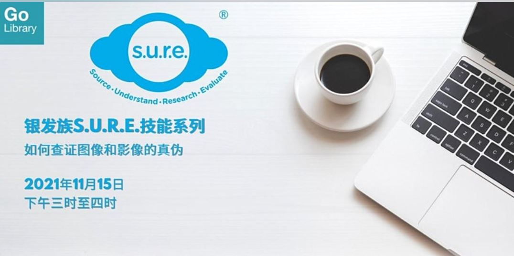

**您是否曾经从社交群组里收到令人感到不安的图像，觉得很可疑却又不能确定？一起来参加这个工作坊，学习如何使用网上的查证工具来核实可疑图像和影像的真伪吧！**

Date: 15 November 2021  Time: 3:00PM to 4:00 PM Conducted via Zoom Free of Charge

**REGISTER [HERE](https://www.eventbrite.sg/e/sure-time-of-your-life-tickets-186596734857?aff=ebdssbonlinesearch)**

## About this event

您是否曾经从社交群组里收到令人感到不安的图像，觉得很可疑却又不能确定？一起来参加这个工作坊，学习如何使用网上的查证工具来核实可疑图像和影像的真伪吧！

本工作坊是**银发族S.U.R.E.技能系列**的第三部分，适合50岁及以上的朋友们参加。

**关于讲员**

叶若诗是国家图书馆的外展服务馆员，专责向公众推广信息素养（Information Literacy）的知识和重要性。