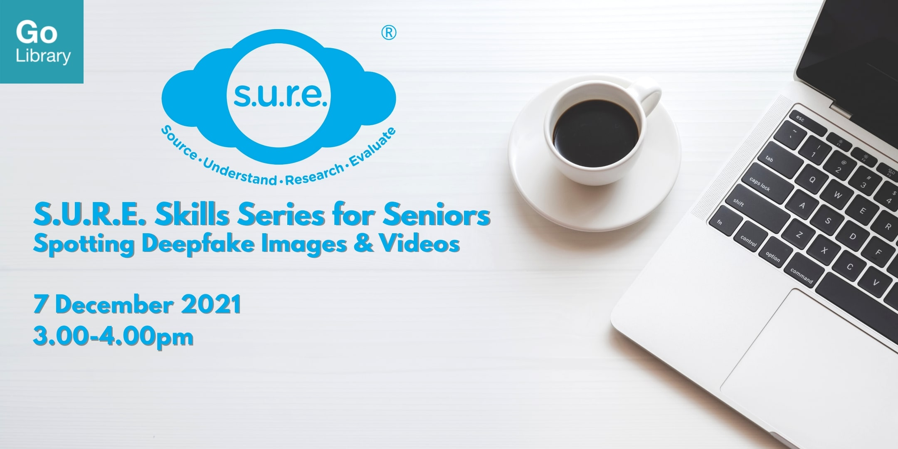

**Learn about Artificial Intelligence-generated deepfake images and videos.**

Date: 7 December 2021  Time: 3:00PM to 4:00 PM Conducted via Zoom Free of Charge

Download the slides **[HERE](https://go.gov.sg/nlb-sure-7dec2021-slides)**.

## About this event

Manipulated images and videos are getting more sophisticated all the time—but so are the techniques that can identify them. Through this engaging workshop, learn more about Artificial Intelligence (AI)-generated deepfake images and videos, how they work, and how to detect them. This programme is accessible for the Deaf and hard of hearing. Zoom’s closed captioning feature will be enabled throughout the session. 

This workshop is Part 3 of the **S.U.R.E. Skills Series for Seniors**, suitable for those aged 50 and above.

S.U.R.E. stands for Source, Understand, Research and Evaluate, and is an initiative of the National Library to educate the public on information literacy. For more information and free resources, please visit us at [sure.nlb.gov.sg](https://sure.nlb.gov.sg/).

**About the Speaker**

Jessie Yak has been with the National Library Board for more than 8 years. She believes that information literacy is an important skill in the increasingly technology-driven society, and wishes to reach out and prepare as many citizens as possible to be literate consumers of the information around them.