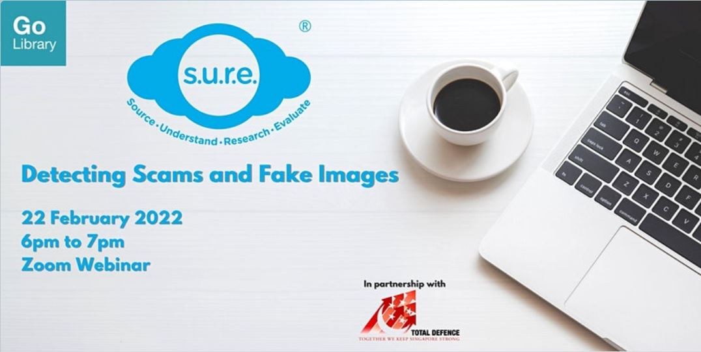

**Level up your Digital Defence skills by learning more about the rising threat of phishing scams and manipulated images.**

Date: Tue, 15 Feb 2022  Time: 6:00PM to 7.00 PM Conducted via Zoom Free of Charge

**Please register [HERE](https://www.eventbrite.sg/e/detecting-scams-and-fake-images-tickets-255052658367?aff=ebdssbonlinesearch).**

**About the Workshop**

Organised by NLB’s S.U.R.E. team in commemoration of Total Defence Day 2022, this interactive webinar will equip participants with the knowledge of the latest threat of phishing scams and manipulated images which are disseminated via social media and messaging apps. Participants will also learn how to detect them using fact-checking techniques and online tools.

S.U.R.E. stands for Source, Understand, Research and Evaluate, and is an initiative of the National Library to educate the public on information literacy.For more information and free resources, please visit us at [sure.nlb.gov.sg](https://sure.nlb.gov.sg/)

**About the Speaker**

Mervin Ang (Manager, Outreach) is a versatile trainer and facilitator with over six years of training experience in the National Library’s Outreach team. He has conducted numerous talks and workshops on information literacy, library databases and combating fake news to diverse audiences, and have trained over 40,000 individuals.