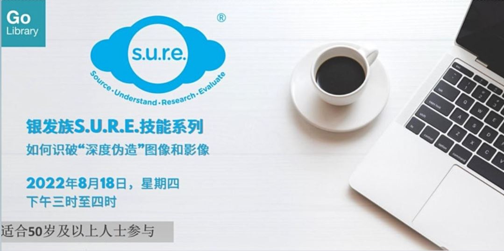

**通过这个工作坊，您能了解什么是利用人工智能（AI）合成的“深度伪造” (Deepfake) 图像和影像，以及如何识破它们。**

Date: Thu, 18 Aug 2022  Time: 3:00PM to 4.00 PM Conducted via Zoom Free of Charge

**Please register [HERE](https://www.eventbrite.sg/e/sure-tickets-244288512517).**

**活动简介** 

随着科技的进步，假造的图片及影片几可乱真，庆幸的是识别真伪的技术也十分先进。通过这个工作坊，您能了解什么是利用人工智能（AI）合成的“深度伪造” (Deepfake) 图像和影像，以及如何识破它们。本工作坊是银发族S.U.R.E.技能系列的最后一个部分

**关于讲员** 

叶若诗是国家图书馆的外展服务馆员，专责向公众推广信息素养（Information Literacy）的知识和重要性。

本活动适合50岁及以上的朋友们参加 。

**（Time of Your Life）《乐在生活 》系列简介** 

《乐在生活》是国家图书馆管理局专为50岁及以上人士而设的一系列服务与活动。活动包括了介绍和探讨健康与保健、个人财务管理、科技资讯及艺术方面的讲座、工作坊、读书会、兴趣小组等。50岁及以上的朋友们可通过这系列的活动学习新知识与技能，确保自己与时俱进