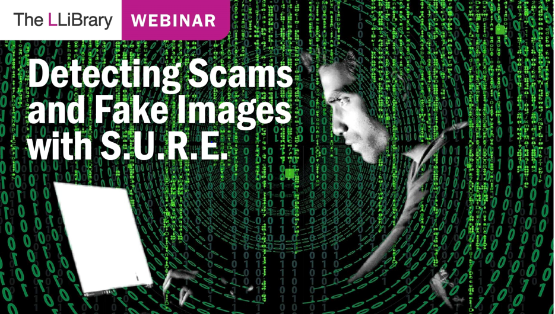

**Participants will learn how to detect phishing scams and manipulated images using fact-checking techniques and online tools.**

Date: Thu, 19 May 2022  Time: 12:30PM to 1.30 PM Conducted via Zoom Free of Charge

**Please register [HERE](https://www.eventbrite.sg/e/detecting-scams-and-fake-images-with-sure-the-llibrary-lunchtime-talk-tickets-303337569837).**

**About the programme**

Over the past year, we have seen a rise of phishing scams and manipulated images, especially during the pandemic.

This interactive webinar will equip participants with the knowledge of the latest threat of phishing scams and manipulated images which are disseminated via social media and messaging apps. Participants will also learn how to detect them using fact-checking techniques and online tools.

S.U.R.E. stands for Source, Understand, Research and Evaluate, and is an initiative of the National Library to educate the public on information literacy.For more information and free resources, please visit us at [sure.nlb.gov.sg](https://sure.nlb.gov.sg/)

**About the speaker**

Nadia Ramli (Librarian, Outreach) has been with the National Library Board (NLB) for more than 6 years. She has conducted numerous tours and talks for children, students and adults during her time at NLB. She believes that information literacy is an important skill for all ages, be it researching projects for school or discerning information on social media.  