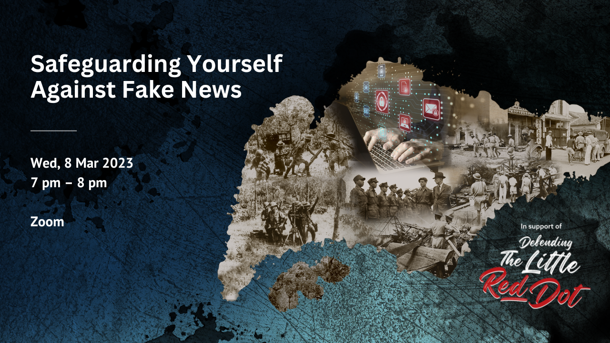

Over the years, the threat of fake news and online misinformation has evolved in their forms and impact on society. In this talk, learn about the characteristics of fake news, the psychological reasons why people fall victim to them and measures on how to safeguard yourself against them using NLB’s S.U.R.E. steps (Source, Understand, Research, Evaluate). 

This webinar was recorded on 8 March 2023, as part of NLB's Defending the Little Red Dot campaign which consisted of talks, book displays and film screenings, highlighting stories of resistance and resilience during the Japanese Occupation, and the importance of preparedness in the digital age.

Download the slides **[HERE](https://go.gov.sg/sure8mar2023)**.

<iframe src="https://nlb.ap.panopto.com/Panopto/Pages/Embed.aspx?id=3926502f-2793-4c06-b35e-afc900056303&autoplay=false&offerviewer=true&showtitle=true&showbrand=true&captions=false&interactivity=all" height="405" width="720" style="border: 1px solid #464646;" allowfullscreen allow="autoplay"></iframe>

