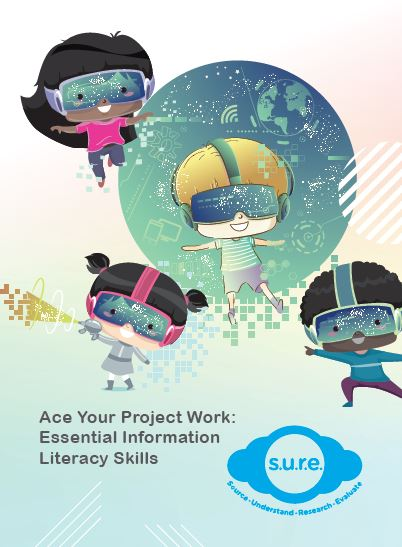

### FOR PRIMARY SCHOOL STUDENTS

**[Ace Your Project Work](/cheatsheet/Ace%20Your%20Project%20Work.pdf)** is a resource for primary school teachers to help their students improve on project work skills. Lesson plans and worksheets based on the S.U.R.E (Source, Understand, Research and Evaluate) steps are enclosed within the resource for teachers to refer to.

