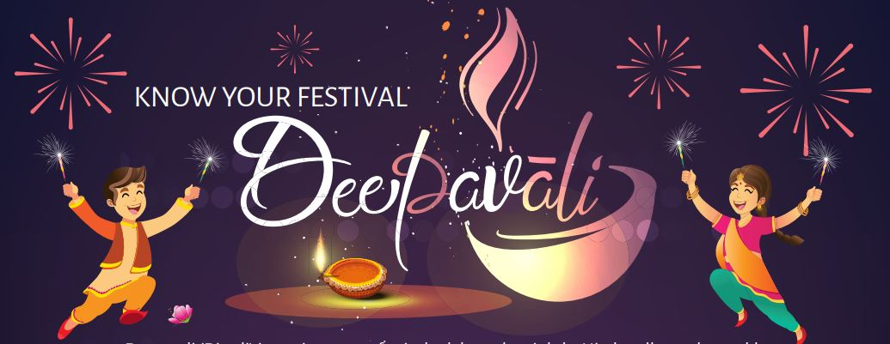

Deepavali (Diwali) is one important festival celebrated mainly by Hindus all over the world. It is known as the Festival of Lights. It celebrates the triumph of good over evil. In Singapore, the streets in Little India are lit up with beautiful decorations, accompanied with activities, about one month before the festival.

Download the infographic here: **[Deepavali](/infographic/2_Deepavali%20Infographic%202020.p)**

