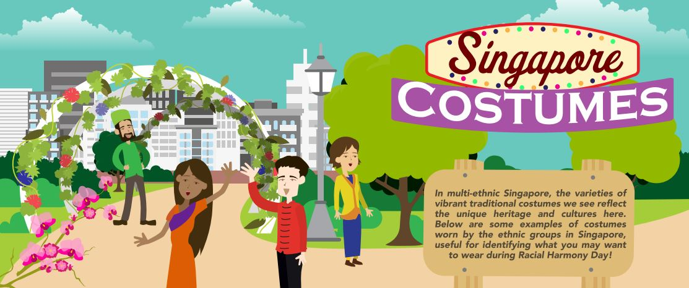

In multi-ethnic Singapore, the varieties of vibrant traditional costumes we see reflect the unique heritage and cultures here. Below are some examples of costumes worn by the ethnic groups of Singapore, useful for identifying what you may want to wear during Racial Harmony Day!  

Download the infographic here: **[Singapore Costumes](/infographic/UPDATED19%20Singapore%20Costumes.pdf)**

