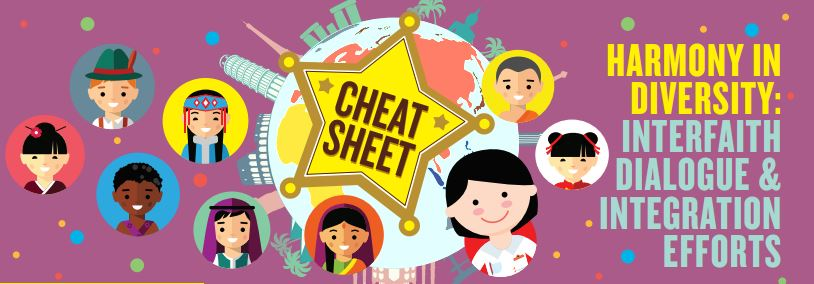

A society is defined as ‘a large group of people who live together in an organized way, making decisions about how to
do things and sharing the work that needs to be done’. 

Download the infographic here: **[Harmony in Diversity - Interfaith Dialogue and Integration Efforts](/cheatsheet/NLB_Cheatsheet_Harmony_in_diversity_Jul2019.pdf)**

