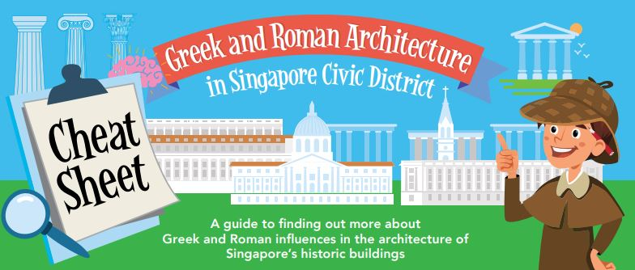

The art and architecture from the ancient civilisations of Greece and Rome have enduring and widespread influence around the world. At its peak in 5th century BC, various great sculptures, structures and artwork were produced in classical Greek style. When the Romans came into power thereafter, they absorbed much of the Greeks’ culture and arts. The combination of the Greco-Roman cultural fusion was often referred to as the ‘classical’ civilisation.

This is a guide to finding out more about Greek and Roman influences in the architecture of Singapore’s historic buildings. 

Download the infographic here: **[Greek and Roman Architecture in Singapore Civic District](https://staging-nlb-sure.netlify.app/cheatsheet/Cheat-sheet-Architecture-lowres%20(1).pdf)**

