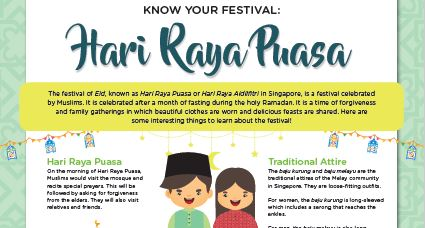

The festival of Eid, known as Hari Raya Puasa or Hari Raya Aidilfitri in Singapore, is a festival celebrated
by Muslims. It is celebrated after a month of fasting during the holy Ramadan. It is a time of forgiveness
and family gatherings in which beautiful clothes are worn and delicious feasts are shared. Here are
some interesting things to learn about the festival!

Download the infographic here: [Know Your Festival: Hari Raya Puasa](/infographic/1_Hari Raya Infographic 2020.pdf)

