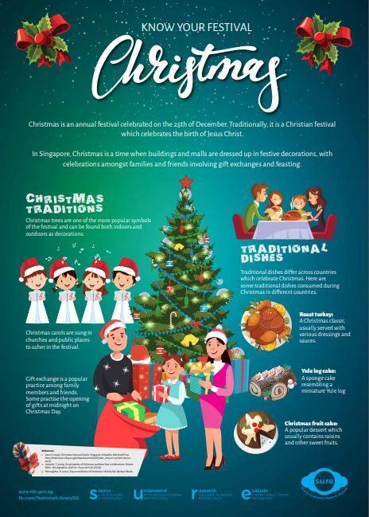

Christmas is an annual festival celebrated on the 25th of December. Traditionally, it is a Christian festival
which celebrates the birth of Jesus Christ.

In Singapore, Christmas is a time when buildings and malls are dressed up in festive decorations, with
celebrations amongst families and friends involving gift exchanges and feasting. 

Download the infographic here: **[Know Your Festival Christmas](/infographic/3_Christmas%20Infographic%202020.pdf)**

