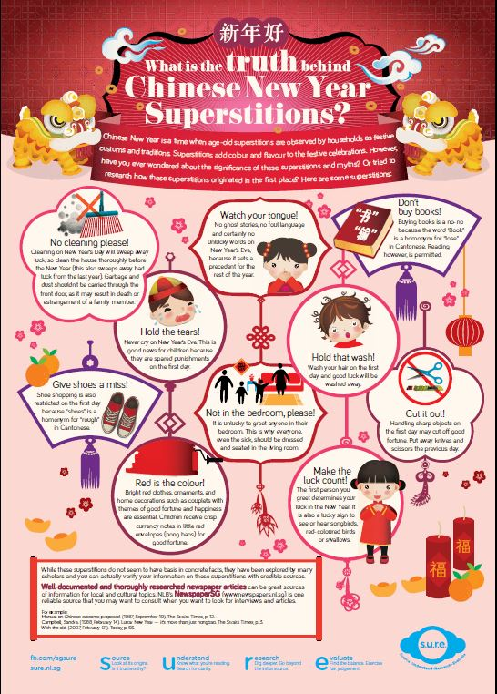

Chinese New Year is a time when age-old superstitions are observed by households as festive customs and traditions. Superstitions add colour and flavour to the festive celebrations. However, have you ever wondered about the significance of these superstitions and myths? Or tried to research how these superstitions originated in the first place? 

Download the infographic here: [What is the truth behind Chinese New Year superstitions?](/infographic/What is the truth behind Chinese New Year Superstitions.pdf)

