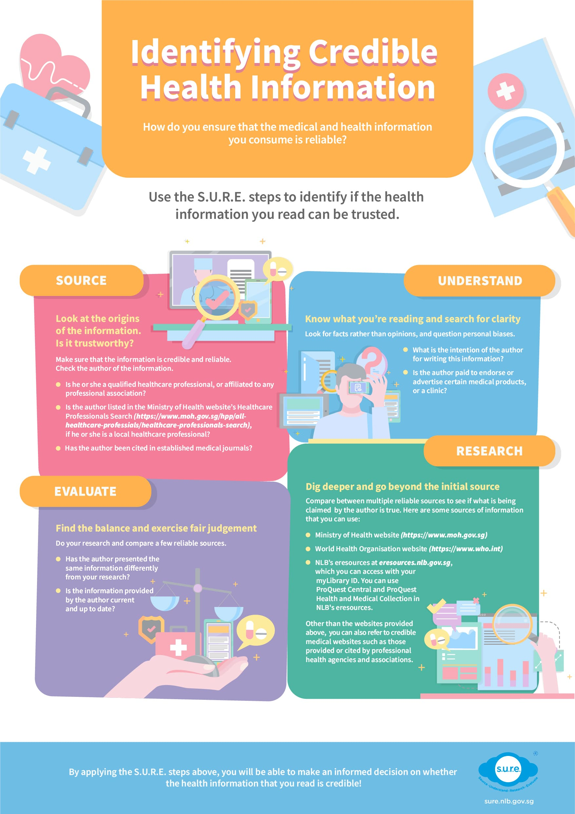

---

layout: post
title:  Identifying Credible Health Information 
date:   2020-04-17
permalink: /blog/information-literacy/IL00001
---

**Identifying Credible Health Information** 

How do you ensure that the medical and health information that you consume is reliable?

Use the S.U.R.E. steps to identify if the health information you read can be trusted.

**Source: Look at the origins of the information. Is it trustworthy?** 

Make sure that the information is credible and reliable. Check the author of the information. Is he or she a qualified healthcare professional, or affiliated to any professional association?

\-           Is the author listed in the [**Ministry of Health website’s Healthcare Professionals Search**](https://www.moh.gov.sg/hpp/all-healthcare-professionals/healthcare-professionals-search), if he or she is a local healthcare professional? 

\-          Has the author been cited in established medical journals? 

**Understand: Know what you’re reading and search for clarity.** 

Look for facts rather than opinions, and question personal biases. You can ask yourself the following questions: 

\-          What is the intention of the author for writing this information? 

\-          Is the author paid to endorse or advertise certain medical products, or a clinic? 

**Research: Dig deeper and go beyond the initial source.** 

Compare between multiple reliable sources to see if what is being claimed by the author is true. Here are some sources of information that you can use:  

\-          **[Ministry of Health website](https://www.moh.gov.sg)** 

\-          **[World Health Organisation website](https://www.who.int)** 

\-          **[NLB’s eresources](https://eresources.nlb.gov.sg)** , which you can access with with your myLibrary ID. You can use ProQuest Central and ProQuest Health and Medical Collection in NLB’s eresources. 

Other than the websites provided above,  you can also refer to credible medical websites such as those provided or cited by professional health agencies and associations. 

**Evaluate: Find the balance and exercise fair judgement.**  

Do your research and compare a few reliable sources. 

\-          Has the author presented the same information differently from your research?

\-          Is the information provided by the author current and up to date? 

By applying the S.U.R.E. steps above, you will be able to make an informed decision on whether the health information that you read is credible!   

**[Download the PDF version HERE](../infographic/Infographic-Identifying-Credible-Health-Information)**.

