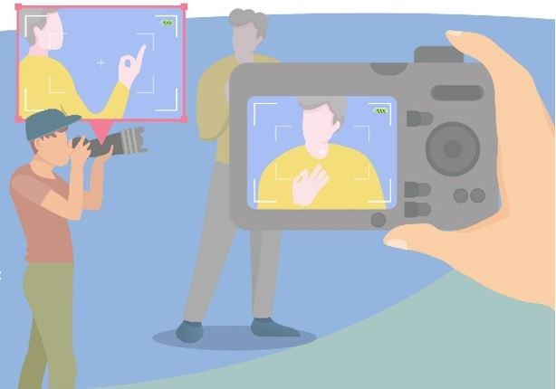
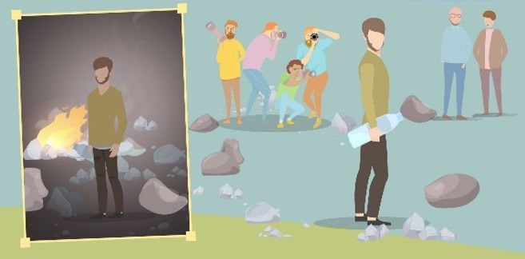
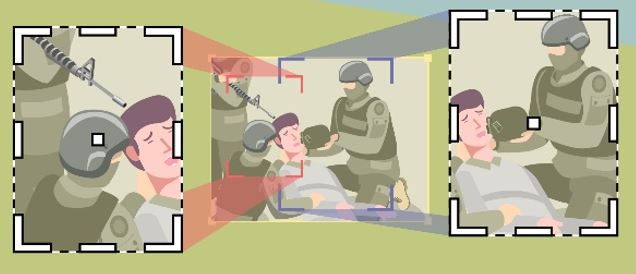
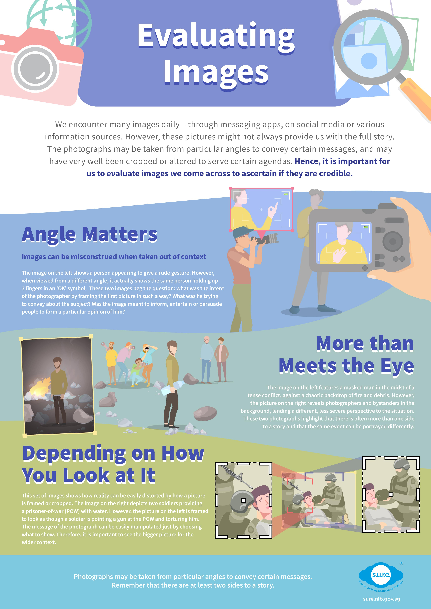

<h1>Evaluating Images</h1>

We encounter many images daily – through messaging apps, on social media or various information sources. However, these pictures might not always provide us with the full story. The photographs may be taken from particular angles to convey certain messages, and may have very well been cropped or altered to serve certain agendas. Hence, it is important for us to evaluate images we come across to ascertain if they are credible.    

**Angle Matters** 

Images can be misconstrued when taken out of context. The image on the left shows a person appearing to give a rude gesture. However, when viewed from a different angle, it actually shows the same person holding up 3 fingers in an ‘OK’ symbol.  These two images beg the question: what was the intent of the photographer by framing the first picture in such a way? What was he trying to convey about the subject? Was the image meant to inform, entertain or persuade people to form a particular opinion of him? 

**More than Meets the Eye** 

The image on the left features a masked man in the midst of a tense conflict, against a chaotic backdrop of fire and debris. However, the picture on the right reveals photographers and bystanders in the background, lending a different, less severe perspective to the situation. These two photographs highlight that there is often more than one side to a story and that the same event can be portrayed differently.  

**Depending on How You Look at It**  

This set of images shows how reality can be easily distorted by how a picture is framed or cropped. The image on the right depicts two soldiers providing a prisoner-of-war (POW) with water. However, the picture on the left is framed to look as though a soldier is pointing a gun at the POW. The message of the photograph can be easily manipulated just by choosing what to show. Therefore, it is important to evaluate any image that you come across.

Download the complete infographic **[HERE](../../../images/SURE-infographic-Evaluating-Images.jpg)**.

