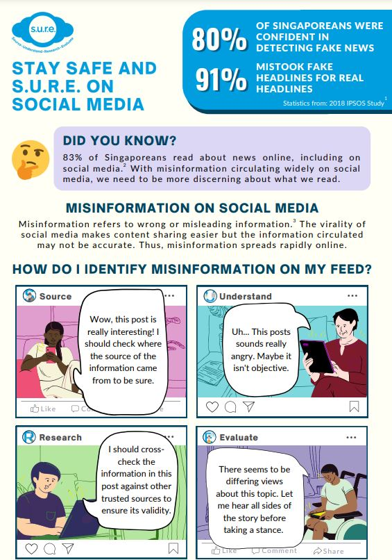
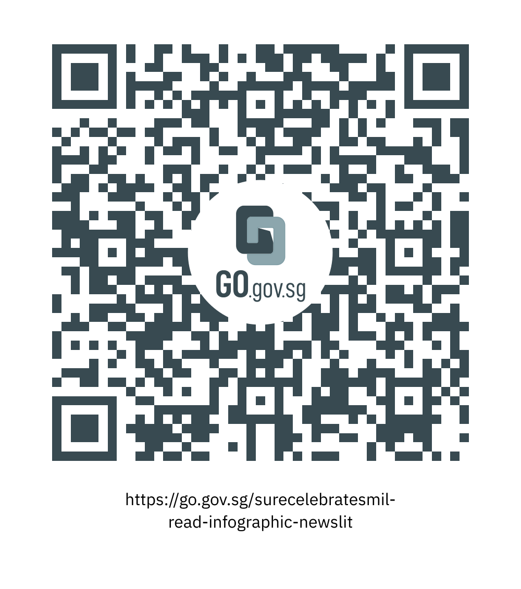

**Click [HERE](/infographic/NLB_Infographic_News_Literacy_SURE_BINGO.pdf) to view the full infographic.**

We hope you enjoyed reading this infographic and picked up some useful tips on how to be S.U.R.E. and safe on social media.

Take part in the National Library Board’s “[S.U.R.E. BINGO Lucky Draw](https://sure.nlb.gov.sg/events/surecelebratesmil-bingo-howtoplay/)” by scanning the QR code or clicking on this link:

https://go.gov.sg/surecelebratesmil-read-infographic-newslit

 *[Note: Link will go live on 1 Oct 2022]*