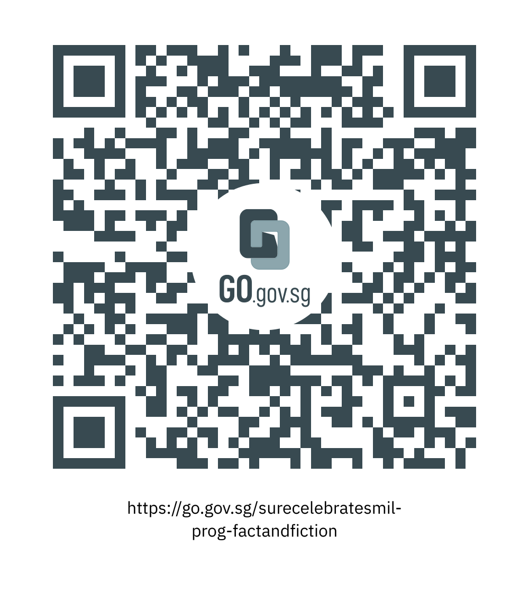

This programme is part of the National Library Board’s S.U.R.E. Celebrates Media and Information Literacy (or M.I.L.) event. In this talk, we have Danny Koordi, Content Strategist (Podcast) and Jasmine Ng, Filmmaker and Director, giving insights and thoughts into the research and inspiration for creating stories across the mediums of films, television and podcasts.

To listen to the podcasts featured in this talk, visit:

- <a href="https://www.melisten.sg/podcast" target="_blank">https://www.melisten.sg/podcast</a>

- <a href="https://aware.org.sg/saga/" target="_blank">https://aware.org.sg/saga/</a>

<iframe src="https://nlb.ap.panopto.com/Panopto/Pages/Embed.aspx?id=f5d48d2f-0455-4da3-b348-af2b0090d139&autoplay=false&offerviewer=false&showtitle=true&showbrand=true&start=0&interactivity=all" height="405" width="720" style="border: 1px solid #464646;" allowfullscreen allow="autoplay"></iframe>

We hope you enjoyed watching this programme and learned more about the research and inspiration behind creating podcasts and films.

Take part in the National Library Board’s [“S.U.R.E. BINGO Lucky Draw”](https://sure.nlb.gov.sg/events/surecelebratesmil-bingo-howtoplay/) by scanning the QR code or clicking on this [link](https://go.gov.sg/surecelebratesmil-prog-fakenewsbuster).

