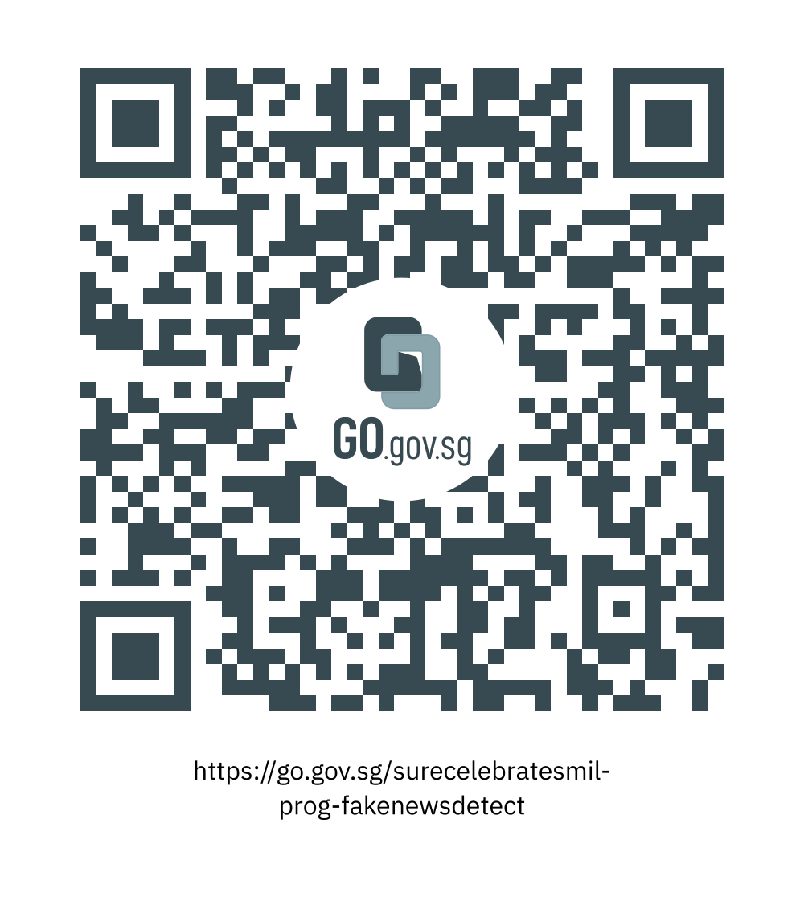

This programme is part of the National Library Board’s S.U.R.E. Celebrates Media and Information Literacy (or M.I.L.) event. In this talk, we have Dr Edson Tandoc and the team from Nanyang Technological University’s Centre for Information Integrity and the Internet (IN-cube) behind the Fake News Detective game.

Visit <a href="https://fakenewsdetective.com/#/" target="_blank">https://fakenewsdetective.com/#/</a> to play the game and fight fake news!

<iframe src="https://nlb.ap.panopto.com/Panopto/Pages/Embed.aspx?id=be563add-a454-4edc-9220-af2b00bb8783&autoplay=false&offerviewer=false&showtitle=true&showbrand=true&start=0&interactivity=all" height="405" width="720" style="border: 1px solid #464646;" allowfullscreen allow="autoplay"></iframe>

We hope you enjoyed watching this programme and learned more about how to create an educational video game and fake news.

Take part in the National Library Board’s [“S.U.R.E. BINGO Lucky Draw”](https://sure.nlb.gov.sg/events/surecelebratesmil-bingo-howtoplay/) by scanning the QR code or clicking on this [link](https://go.gov.sg/surecelebratesmil-prog-fakenewsdetect).

