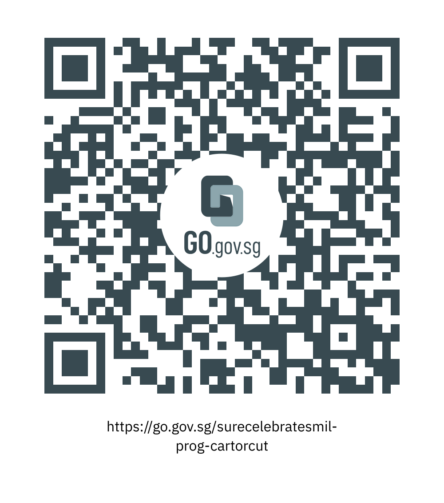

This programme is part of the National Library Board’s S.U.R.E. Celebrates Media and Information Literacy (or M.I.L.) event.

 

Mervin Ang from the National Library Board shares with us about the rising trend of online shopping, its risks and how to apply the S.U.R.E. (Source, Understand, Research, Evaluate) steps to ensure that your next online purchase is safe and authentic.

To watch the video featured in this talk, visit “[Are You Spending More Shopping Online?](https://youtu.be/HxsFGE5drr4)” by CNA Insider

<iframe src="https://nlb.ap.panopto.com/Panopto/Pages/Embed.aspx?id=d4852284-e7ac-45b1-aa34-af33001aaf00&autoplay=false&offerviewer=false&showtitle=true&showbrand=true&start=0&interactivity=all" height="405" width="720" style="border: 1px solid #464646;" allowfullscreen allow="autoplay"></iframe>

We hope you enjoyed watching this programme and picked up some useful tips on how to apply S.U.R.E. to your online shopping. 

 

Take part in the National Library Board’s [“S.U.R.E. BINGO Lucky Draw”](https://sure.nlb.gov.sg/events/surecelebratesmil-bingo-howtoplay/) by scanning the QR code or clicking on this link.

 https://go.gov.sg/surecelebratesmil-prog-cartorcut

 

