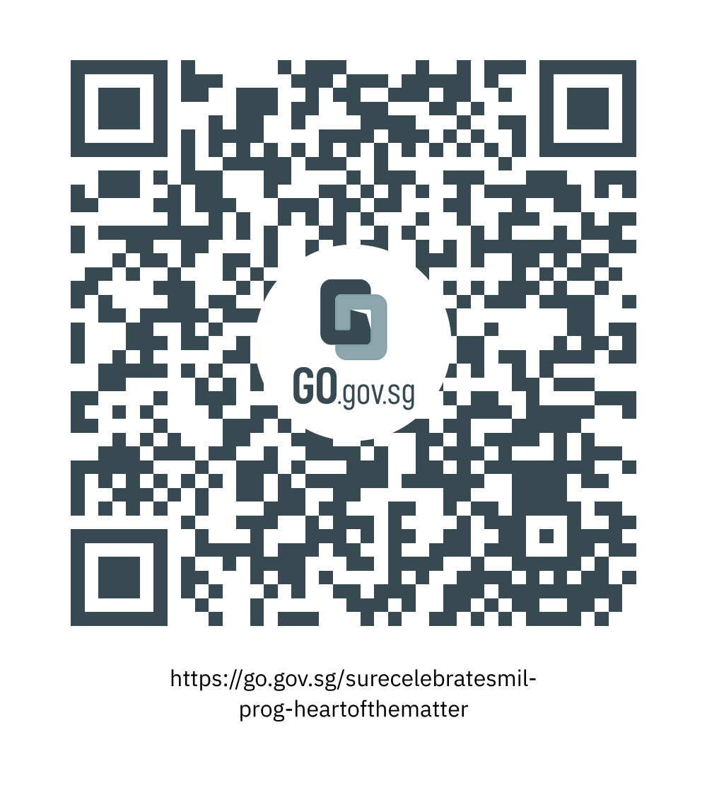

This programme is part of the National Library Board’s S.U.R.E. Celebrates Media and Information Literacy (or M.I.L.) event.

 

In this workshop, Nisha Rai, co-president of safeNUS, shared tips to equip us with basic understanding of what constitutes online harms, in particular, technology-facilitated sexual violent (TFSV), concepts of consent, respect and boundaries, and how one can be an effective peer supporter.

 

<iframe src="https://nlb.ap.panopto.com/Panopto/Pages/Embed.aspx?id=8bb3afeb-e283-4941-9fba-af35006441b1&autoplay=false&offerviewer=false&showtitle=true&showbrand=true&start=0&interactivity=all" height="405" width="720" style="border: 1px solid #464646;" allowfullscreen allow="autoplay"></iframe>

We hope you enjoyed watching this programme and learned more about online harms, and how we can become a more effective peer supporter.  

 

Take part in the National Library Board’s [“S.U.R.E. BINGO Lucky Draw”](https://sure.nlb.gov.sg/events/surecelebratesmil-bingo-howtoplay/) by scanning the QR code or clicking on this link:

[https://go.gov.sg/surecelebratesmil-prog-heartofthematter](https://go.gov.sg/surecelebratesmil-prog-heartofthematter)

