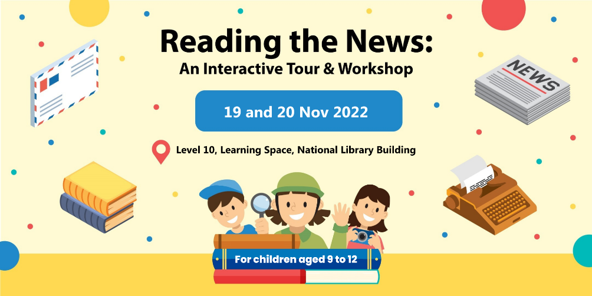

*Learn about the importance of news and information literacy in this fun and interactive tour and workshop at the National Library.*

In this programme, families with children will learn about the importance of news and information literacy by going through The News Gallery: Beyond Headlines exhibition and interactive games hosted by our engaging facilitators. 

- The programme venue and registration is found at Level 10 of the National Library Building (100 Victoria Street, S188064)
- Participants are encouraged to bring smart devices as digital activities will be used to engage the children

| **19 Nov (Sat)**** 10am – 11am** [Registration link](https://www.eventbrite.com/e/440140410817) | **19 Nov (Sat)**** 2pm – 3pm** [Registration link](https://www.eventbrite.com/e/440140631477) | **20 Nov (Sun)**** 2pm – 3pm** [Registration link](https://www.eventbrite.com/e/440141534177) |
| ------------------------------------------------------------ | ------------------------------------------------------------ | ------------------------------------------------------------ |
|                                                              |                                                              |                                                              |

 