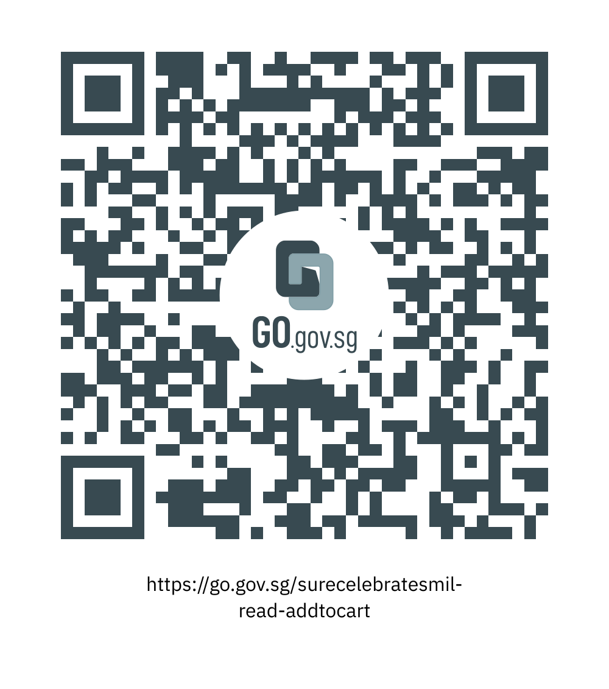

                               

*Image credit: [Pixabay](http://www.pixabay.com)*

 

Drawn by its ostentatiously low prices and eclectic mix of products, and further intensified by the current pandemic, more Singaporeans have turned to [online shopping](https://www.straitstimes.com/business/economy/one-third-of-singaporeans-made-first-online-purchase-amid-covid-19-pandemic-visa).

 

With its heavily discounted prices and never-ending stream of vouchers, platforms like Shopee, Lazada, and Taobao are slowly taking over department stores and shopping malls. Not only that, but they also employ the use of [mini-games](https://www.hatch.sg/post/campaign-insights-3-digital-marketing-insights-from-shopee-9-9-2020-marketing-campaign) and lucky draws to attract consumers to open the application and spend some digital cash. In return, consumers gain tiny discounts or credits that they can exchange for *even more* vouchers and discounts.

 

In some ways, it’s almost as if these applications are giving out free money. Yet, even with its cost-saving features, we can’t help but wonder how else we can leverage on its convenience and accessibility to get as much as we can- while spending as little as possible.

 

Being a discerning shopper is possible with **S.U.R.E.** skills in hand. 

S.U.R.E. distils key Information Literacy (IL) concepts into 4 simple ways:

·    **Source: Look at its origins. Are they trustworthy?**
 Make sure that the source of information is credible and reliable.

·    **Understand: Know what you’re reading. Search for clarity.**
 Look for facts rather than opinions. Question personal biases.

·    **Research: Dig deeper. Go beyond the initial source.**
 Investigate thoroughly before making a conclusion. Check and compare with multiple sources.

·    **Evaluate: Find the balance. Exercise fair judgement.**
 Look from different angles. There are at least two sides to every story.

 

Read on to find out how you can apply the S.U.R.E. steps when you next shop online!

 

### Look at the sellers. Are they trustworthy?

(Check your Sources and Understand the information provided)

 

 *Image credit: [Pixabay](http://www.pixabay.com)*

 

Falling prey to [e-commerce scams](https://www.police.gov.sg/media-room/news/20211109_police_advisory_on_e-commerce_scam_during_the_year_end_online_shopping_events) and losing your money is the furthest course of action from saving it. Keep yourself safe by checking who exactly you are buying from. How many sales have they made? How have buyers reviewed them? Before buying anything, it is always a good practice to make sure that you’re spending money on a reputable seller.

### Compare products.

(Research across websites)

 

 

*Image credit: [Pixabay](http://www.pixabay.com)*

 

 

Assuming you’ve checked your sellers and verified their credibility, there’s an extra step you can take to ensure that you will only be investing in the most value-for-money product you can find. [Cross-checking the same product](https://www.forbes.com/sites/forbesbusinesscouncil/2021/06/18/how-consumers-compare-prices-to-make-purchase-decisions/?sh=26f2cd286486) against different sellers- and even platforms will make sure you’re not spending $50 on something worth $40. Sellers will definitely try to upsell their products, so it’s worth conducting a little bit of research before you whip out your wallet.

 

### Don’t fall prey to marketing tactics

(Evaluate before making a decision)

 

*Image credit: [Pixabay](http://www.pixabay.com)*

 

It’s easy to constantly keep adding to your cart and convince yourself that you need something especially during [shopping events](https://www.cnbc.com/2019/11/29/psychology-of-black-friday-shopping-phenomenon-and-crowds-explained.html) like 11.11 and Black Friday. These events encourage you to spend for the sake of it out of the fear of missing out on vouchers and deals. However, don’t fall prey to these marketing tactics! Companies like Shopee give out vouchers almost every day, so you can afford to buy only when you need it.

 

And that’s how you can apply the S.U.R.E. steps to your online shopping and avoid getting duped! 

 

### References:

[https://dollarsandsense.sg/busy-singaporeans-guide-using-saving-money-shopee/](https://dollarsandsense.sg/busy-singaporeans-guide-using-saving-money-shopee/)

[https://blog.hubspot.com/marketing/how-to-write-blog-post-outline](https://blog.hubspot.com/marketing/how-to-write-blog-post-outline)

 

*This article was written by Amelia Yew.*  Amelia participated in the NLB Work Experience Programme with the Programmes and Exhibition Division in December 2021.* 

We hope you enjoyed reading this blog post and picked up some useful tips on how to be S.U.R.E. before you shop online.

 

Take part in the National Library Board’s [“S.U.R.E. BINGO Lucky Draw”](https://sure.nlb.gov.sg/events/surecelebratesmil-bingo-howtoplay/)  by scanning the QR code or clicking on this link:

https://go.gov.sg/surecelebratesmil-read-addtocart

 

*[Note: Link will go live on 1 Oct 2022]*