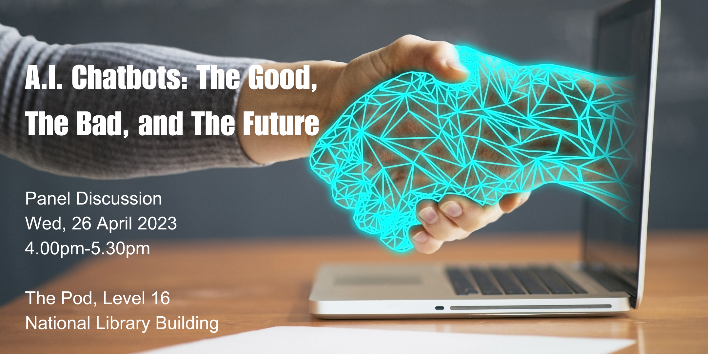

**In this panel discussion organised by NLB, learn from industry experts on the role of A.I. chatbots in the current and future world.**

Date and time: Wednesday, 26 Apr 2023, 4:00pm - 5:30pm
 Location: **National Library, The Pod**  100 Victoria Street Level 16 Singapore, 188064

This event has ended.

### About the Programme

A.I. chatbots have become increasingly popular in recent years as they have the potential to revolutionise the way we communicate and interact with technology. Join our expert panel as they explore the current state of A.I. chatbots, the benefits and limitations of this technolosgy, and their future implications for various industries. Learn from industry experts who are familiar with communication, education and A.I. chatbot technology, each with unique insights and perspectives on this topic. Participants will gain a deeper understanding of the role of A.I. chatbots in the current and future world.

### Speakers

**Dr Natalie Pang**

Dr. Pang is Deputy Head at the Communications and New Media Department, and Principal Investigator at the Centre for Trusted Internet and Community at the National University of Singapore. Other than her academic work, she also heads NUS Libraries as University Librarian. In Singapore, she currently serves as a member of the Media Literacy Council and Special Advisor to the Digital and Information Literacy Community of Practice at the National Library Board. With regard to A.I., she contributes as a member of the University Policy Workgroup for AI in Teaching and Learning at NUS.  More recently, she has also contributed insights as a stakeholder to a report published by UNESCO and Mila – Quebec Artificial Intelligence Institute on “Missing Links in AI Governance”.

**Prof. Andrew Prahl**

Prof. Prahl (PhD University of Wisconsin-Madison) is an Assistant Professor at the Wee Kim Wee School of Communication & Information at Nanyang Technological University. Andrew’s research investigates the effects of disruptive technologies on human communication and society. Some of his recent work looks at the issues of humans being replaced by automation in the workplace, what AI means for advertising and public relations, and how generative AI technologies are redefining human creativity. He also draws upon a decade of experience in the advertising, outreach and public relations industry in his research.

**Mr. Chuang Shin Wee**

Mr. Chuang is the Founder and CEO of Pand.ai, a Singapore-headquartered specialist in conversational AI. Today, Pand.ai serves a number of blue-chip companies across Southeast Asia including Allianz, Bangkok Bank, CIMB, Great Eastern, MSIG and Schroders. Prior to founding Pand.ai, Shin Wee was the Head of Digital Banking for Standard Chartered Bank in China, where he built a number of award-winning digital capabilities for the bank. In 2013, he was named “Top 50 Business Innovators in China” by CBN Weekly for inventing an ATM software that helped the bank reduced the cost per new-to-bank lead by more than 90%.  

**Prof. Edson Tandoc Jr. (Moderator)**

Prof. Tandoc Jr. is an Associate Professor and the Associate Chair for Research at the Wee Kim Wee School of Communication and Information at Nanyang Technological University in Singapore, where he is the Director of the Centre for Information Integrity and the Internet (IN-cube). He is also an Associate Editor of two journals: Digital Journalism and Human Communication Research and the Vice Chair of the Journalism Studies Division of the International Communication Association. His studies have focused on the impact of journalistic roles, new technologies, and audience feedback on the news gatekeeping process.